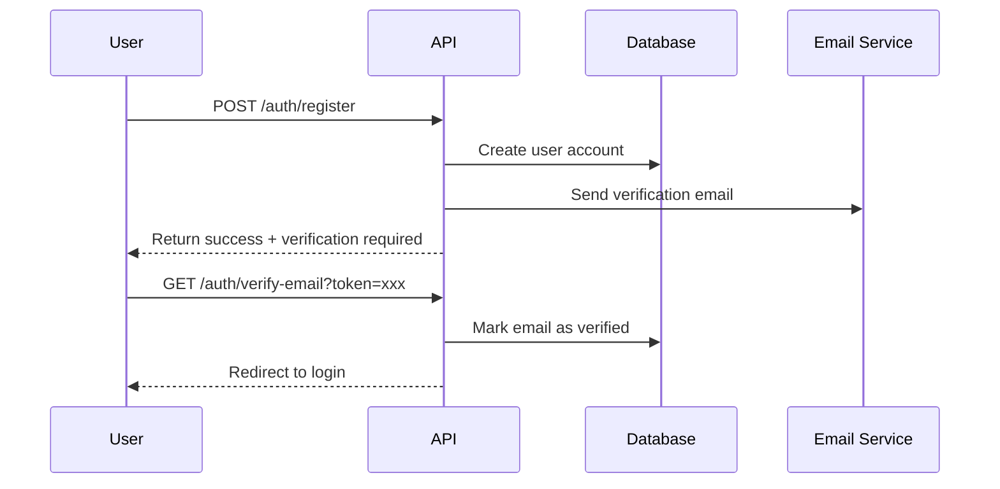
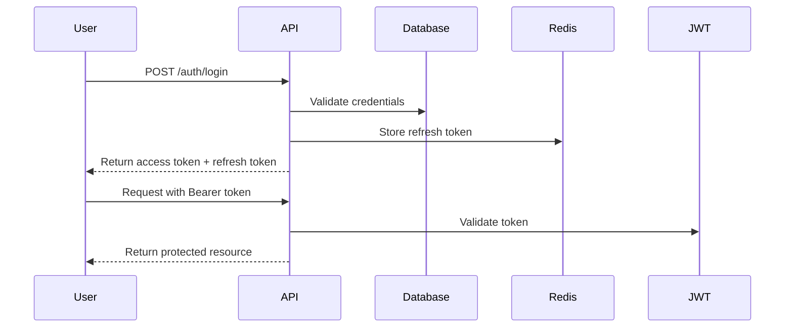

# Authentication API Documentation

## Overview

The BOOM Card authentication system provides secure access control for consumers, partners, and administrators. The API supports JWT-based authentication with refresh tokens, OAuth2 social login integration, and comprehensive session management.

## Base URL

```
Production: https://api.boomcard.bg/v1
Staging: https://staging-api.boomcard.bg/v1
```

## Authentication Flow

### 1. Registration Flow



### 2. Login Flow



## API Endpoints

### POST /auth/register

Register a new user account.

**Request Body:**
```json
{
  "email": "user@example.com",
  "password": "SecurePassword123!",
  "firstName": "John",
  "lastName": "Doe",
  "phone": "+359888123456",
  "userType": "consumer",
  "acceptTerms": true,
  "language": "en"
}
```

**Response:**
```json
{
  "success": true,
  "message": "Registration successful. Please check your email to verify your account.",
  "data": {
    "userId": "550e8400-e29b-41d4-a716-446655440000",
    "email": "user@example.com",
    "requiresVerification": true
  }
}
```

**Error Responses:**
- `400 Bad Request` - Invalid input data
- `409 Conflict` - Email already exists

### POST /auth/login

Authenticate user and receive tokens.

**Request Body:**
```json
{
  "email": "user@example.com",
  "password": "SecurePassword123!",
  "rememberMe": true
}
```

**Response:**
```json
{
  "success": true,
  "data": {
    "accessToken": "eyJhbGciOiJIUzI1NiIs...",
    "refreshToken": "550e8400-e29b-41d4-a716-446655440000",
    "expiresIn": 3600,
    "tokenType": "Bearer",
    "user": {
      "id": "550e8400-e29b-41d4-a716-446655440000",
      "email": "user@example.com",
      "firstName": "John",
      "lastName": "Doe",
      "userType": "consumer",
      "emailVerified": true,
      "language": "en"
    }
  }
}
```

**Error Responses:**
- `401 Unauthorized` - Invalid credentials
- `403 Forbidden` - Account not verified or suspended

### POST /auth/refresh

Refresh access token using refresh token.

**Request Body:**
```json
{
  "refreshToken": "550e8400-e29b-41d4-a716-446655440000"
}
```

**Response:**
```json
{
  "success": true,
  "data": {
    "accessToken": "eyJhbGciOiJIUzI1NiIs...",
    "expiresIn": 3600,
    "tokenType": "Bearer"
  }
}
```

### POST /auth/logout

Invalidate current session.

**Headers:**
```
Authorization: Bearer {accessToken}
```

**Request Body:**
```json
{
  "refreshToken": "550e8400-e29b-41d4-a716-446655440000"
}
```

**Response:**
```json
{
  "success": true,
  "message": "Logged out successfully"
}
```

### GET /auth/verify-email

Verify email address using token from email.

**Query Parameters:**
- `token` (required) - Verification token from email

**Response:**
```json
{
  "success": true,
  "message": "Email verified successfully",
  "redirectUrl": "/login?verified=true"
}
```

### POST /auth/forgot-password

Request password reset email.

**Request Body:**
```json
{
  "email": "user@example.com"
}
```

**Response:**
```json
{
  "success": true,
  "message": "If an account exists with this email, a password reset link has been sent."
}
```

### POST /auth/reset-password

Reset password using token from email.

**Request Body:**
```json
{
  "token": "550e8400-e29b-41d4-a716-446655440000",
  "newPassword": "NewSecurePassword123!",
  "confirmPassword": "NewSecurePassword123!"
}
```

**Response:**
```json
{
  "success": true,
  "message": "Password reset successfully"
}
```

### POST /auth/change-password

Change password for authenticated user.

**Headers:**
```
Authorization: Bearer {accessToken}
```

**Request Body:**
```json
{
  "currentPassword": "CurrentPassword123!",
  "newPassword": "NewSecurePassword123!",
  "confirmPassword": "NewSecurePassword123!"
}
```

**Response:**
```json
{
  "success": true,
  "message": "Password changed successfully"
}
```

### GET /auth/me

Get current user profile.

**Headers:**
```
Authorization: Bearer {accessToken}
```

**Response:**
```json
{
  "success": true,
  "data": {
    "id": "550e8400-e29b-41d4-a716-446655440000",
    "email": "user@example.com",
    "firstName": "John",
    "lastName": "Doe",
    "phone": "+359888123456",
    "userType": "consumer",
    "emailVerified": true,
    "phoneVerified": false,
    "language": "en",
    "createdAt": "2024-01-15T10:30:00Z",
    "subscription": {
      "status": "active",
      "plan": "premium",
      "expiresAt": "2024-12-31T23:59:59Z"
    }
  }
}
```

### PATCH /auth/me

Update current user profile.

**Headers:**
```
Authorization: Bearer {accessToken}
```

**Request Body:**
```json
{
  "firstName": "John",
  "lastName": "Smith",
  "phone": "+359888123456",
  "language": "bg"
}
```

**Response:**
```json
{
  "success": true,
  "message": "Profile updated successfully",
  "data": {
    "id": "550e8400-e29b-41d4-a716-446655440000",
    "email": "user@example.com",
    "firstName": "John",
    "lastName": "Smith",
    "phone": "+359888123456",
    "language": "bg"
  }
}
```

## OAuth2 Social Login

### GET /auth/oauth/{provider}

Initiate OAuth2 flow.

**Providers:**
- `google`
- `facebook`
- `apple`

**Query Parameters:**
- `redirectUri` (optional) - Custom redirect after authentication

**Response:**
Redirects to provider's OAuth2 authorization page.

### GET /auth/oauth/{provider}/callback

OAuth2 callback endpoint.

**Query Parameters:**
- `code` - Authorization code from provider
- `state` - CSRF protection state

**Response:**
Redirects to frontend with authentication tokens in query parameters:
```
https://app.boomcard.bg/auth/callback?accessToken=xxx&refreshToken=xxx
```

## Two-Factor Authentication (2FA)

### POST /auth/2fa/enable

Enable 2FA for current user.

**Headers:**
```
Authorization: Bearer {accessToken}
```

**Response:**
```json
{
  "success": true,
  "data": {
    "secret": "JBSWY3DPEHPK3PXP",
    "qrCode": "data:image/png;base64,iVBORw0KGgo...",
    "backupCodes": [
      "A1B2-C3D4",
      "E5F6-G7H8",
      "I9J0-K1L2"
    ]
  }
}
```

### POST /auth/2fa/verify

Verify 2FA token during login.

**Request Body:**
```json
{
  "token": "123456",
  "sessionId": "550e8400-e29b-41d4-a716-446655440000"
}
```

**Response:**
```json
{
  "success": true,
  "data": {
    "accessToken": "eyJhbGciOiJIUzI1NiIs...",
    "refreshToken": "550e8400-e29b-41d4-a716-446655440000",
    "expiresIn": 3600,
    "tokenType": "Bearer"
  }
}
```

### POST /auth/2fa/disable

Disable 2FA for current user.

**Headers:**
```
Authorization: Bearer {accessToken}
```

**Request Body:**
```json
{
  "password": "CurrentPassword123!",
  "token": "123456"
}
```

**Response:**
```json
{
  "success": true,
  "message": "Two-factor authentication disabled"
}
```

## Partner Authentication

### POST /auth/partner/register

Register new partner account.

**Request Body:**
```json
{
  "businessName": "Restaurant Sofia",
  "businessType": "restaurant",
  "registrationNumber": "BG123456789",
  "vatNumber": "BG123456789",
  "address": {
    "street": "Vitosha Blvd 123",
    "city": "Sofia",
    "postalCode": "1000",
    "country": "BG"
  },
  "contactPerson": {
    "firstName": "Ivan",
    "lastName": "Petrov",
    "email": "ivan@restaurant.bg",
    "phone": "+359888123456"
  },
  "password": "SecurePassword123!",
  "acceptTerms": true
}
```

**Response:**
```json
{
  "success": true,
  "message": "Partner registration submitted for review",
  "data": {
    "partnerId": "550e8400-e29b-41d4-a716-446655440000",
    "status": "pending_review"
  }
}
```

### POST /auth/partner/login

Partner-specific login endpoint.

**Request Body:**
```json
{
  "email": "partner@business.com",
  "password": "SecurePassword123!",
  "posTerminalId": "POS-123" // Optional, for POS system login
}
```

**Response:**
```json
{
  "success": true,
  "data": {
    "accessToken": "eyJhbGciOiJIUzI1NiIs...",
    "refreshToken": "550e8400-e29b-41d4-a716-446655440000",
    "expiresIn": 3600,
    "tokenType": "Bearer",
    "partner": {
      "id": "550e8400-e29b-41d4-a716-446655440000",
      "businessName": "Restaurant Sofia",
      "status": "active",
      "permissions": ["manage_discounts", "view_analytics", "process_transactions"]
    }
  }
}
```

## Security Headers

All authenticated requests must include:

```
Authorization: Bearer {accessToken}
X-Request-ID: {unique-request-id}
X-Client-Version: 1.0.0
```

## Rate Limiting

- Registration: 5 requests per hour per IP
- Login: 10 requests per 15 minutes per IP
- Password reset: 3 requests per hour per email
- API calls: 1000 requests per hour per user

Rate limit headers:
```
X-RateLimit-Limit: 1000
X-RateLimit-Remaining: 999
X-RateLimit-Reset: 1642082400
```

## Error Responses

Standard error format:
```json
{
  "success": false,
  "error": {
    "code": "AUTH_INVALID_CREDENTIALS",
    "message": "Invalid email or password",
    "field": "password",
    "timestamp": "2024-01-15T10:30:00Z",
    "requestId": "550e8400-e29b-41d4-a716-446655440000"
  }
}
```

Common error codes:
- `AUTH_INVALID_CREDENTIALS` - Invalid email/password
- `AUTH_EMAIL_NOT_VERIFIED` - Email verification required
- `AUTH_ACCOUNT_SUSPENDED` - Account suspended
- `AUTH_TOKEN_EXPIRED` - Access token expired
- `AUTH_TOKEN_INVALID` - Invalid or malformed token
- `AUTH_INSUFFICIENT_PERMISSIONS` - Insufficient permissions
- `AUTH_2FA_REQUIRED` - 2FA verification required
- `AUTH_2FA_INVALID` - Invalid 2FA token
- `AUTH_RAT